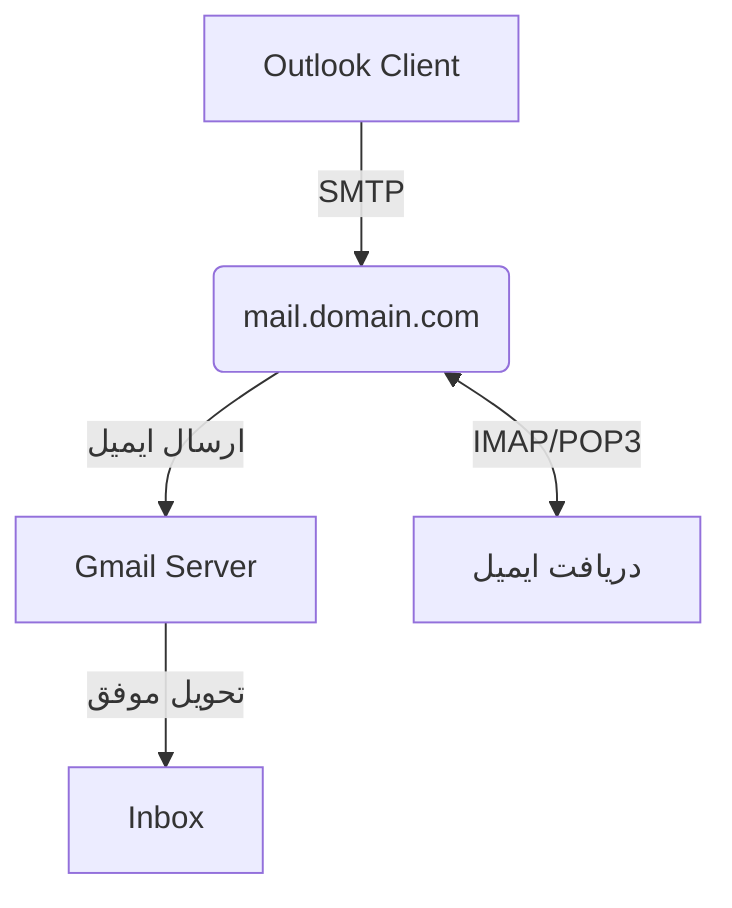
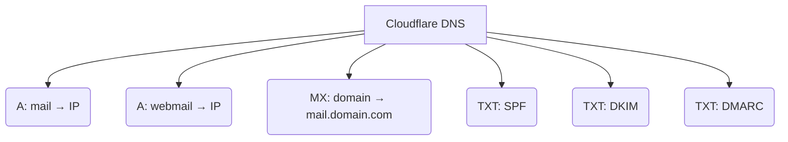

# 📬 راه‌اندازی حرفه‌ای ایمیل در cPanel با Cloudflare + اتصال به Outlook


راهنمای کامل، حرفه‌ای و گرافیکی برای تنظیم ایمیل روی هاست‌های cPanel در حالی که DNS دامنه توسط Cloudflare مدیریت می‌شود. مناسب برای اتصال به Outlook، جلوگیری از اسپم شدن و تحویل موفق ایمیل‌ها به Gmail.

---

## 🎯 اهداف این راهنما

- اتصال مطمئن ایمیل به Outlook یا سایر کلاینت‌ها با SMTP و IMAP/POP3
- ارسال موفق ایمیل به Gmail و سایر سرویس‌دهنده‌ها
- جلوگیری از اسپم شدن با تنظیم SPF، DKIM و DMARC
- بررسی خطاها، مسیرها و ابزارهای تست دقیق

---

## 🧭 مسیر جریان ارسال و دریافت ایمیل



---

## 🧱 ساختار رکوردهای DNS مورد نیاز



---

## 🔧 تنظیم رکوردهای DNS در Cloudflare

| نوع رکورد | Name     | Value / IP            | Proxy     |
|-----------|----------|------------------------|-----------|
| A         | mail     | YOUR.SERVER.IP         | DNS only  |
| A         | cpanel   | YOUR.SERVER.IP         | DNS only  |
| A         | webmail  | YOUR.SERVER.IP         | DNS only  |
| MX        | domain.com | mail.domain.com      | DNS only  |

> ⚠️ **هشدار:** رکوردهای `mail`, `cpanel`, `webmail` نباید Proxied (ابری) باشند!

---

## 📄 رکورد SPF (برای تأیید فرستنده)

```txt
v=spf1 +a +mx ip4:92.126.171.80 ~all
```

> 💡 **نکته:** جایگزین هر رکورد قبلی SPF مربوط به Cloudflare Email Routing بشود.

---

## 🔐 فعال‌سازی DKIM

از مسیر زیر در cPanel:
```
Email > Email Deliverability
```
- روی **Repair** بزن یا رکورد پیشنهادی `default._domainkey` را کپی و در Cloudflare اضافه کن.

---

## 🛡️ رکورد DMARC (اختیاری ولی مهم)

```txt
Name: _dmarc
Type: TXT
Value: v=DMARC1; p=none; sp=none; adkim=r; aspf=r;
```

> ✅ پس از تست موفق می‌تونی `p=reject` برای جلوگیری از جعل استفاده کنی.

---

## 💻 تنظیمات Outlook یا سایر کلاینت‌ها

| تنظیم             | مقدار                          |
|------------------|---------------------------------|
| Email            | test@domain.com                 |
| Username         | test@domain.com                 |
| Password         | رمز عبور ایمیل                  |
| Incoming Server  | mail.domain.com                 |
| Incoming Port    | 993 (IMAP) / 995 (POP3)         |
| Outgoing Server  | mail.domain.com                 |
| Outgoing Port    | 465 (SSL) یا 587 (TLS)          |
| Encryption       | SSL/TLS                         |
| Auth Required    | Yes                             |

---

## 🚫 خطاهای رایج و راه‌حل‌ها

> ❌ **ارسال ایمیل انجام نمی‌شود اما دریافت کار می‌کند؟**

- رکورد `mail` در Cloudflare به اشتباه روی Proxied است ← باید DNS Only شود
- SPF یا DKIM تنظیم نشده یا اشتباه است
- IP سرور SMTP در SPF تعریف نشده
- Gmail می‌گوید:

```
550-5.7.26 Gmail requires all senders to authenticate with either SPF or DKIM.
```

---

## ✍️ نمونه رکوردهای پیشنهادی (کامل)

```txt
# ✅ SPF
v=spf1 +a +mx ip4:92.126.171.80 ~all

# ✅ DKIM
default._domainkey.domain.com  (از cPanel دریافت شود)

# ✅ DMARC
v=DMARC1; p=none; sp=none; adkim=r; aspf=r;
```

---


## 💡 نکات تکمیلی

- از IP صحیح هاست در SPF استفاده کن
- رکورد `mail` باید خاکستری (DNS Only) باشد
- ابتدا از `p=none` در DMARC استفاده کن، سپس `reject`
- تست ایمیل قبل از استفاده در تولید بسیار مهم است

---

## 🧠 نویسنده : Ali Darehshori

تهیه‌شده با تجربه عملی در راه‌اندازی ایمیل روی cPanel پشت Cloudflare با اتصال کامل به Outlook و Gmail.

> #### اگر مفید بود، ⭐ بده و با دیگران به اشتراک بذار 🙌


## 📎 لایسنس

[A License – استفاده آزاد با من](https://github.com/ali80da/a-license) ❤️
